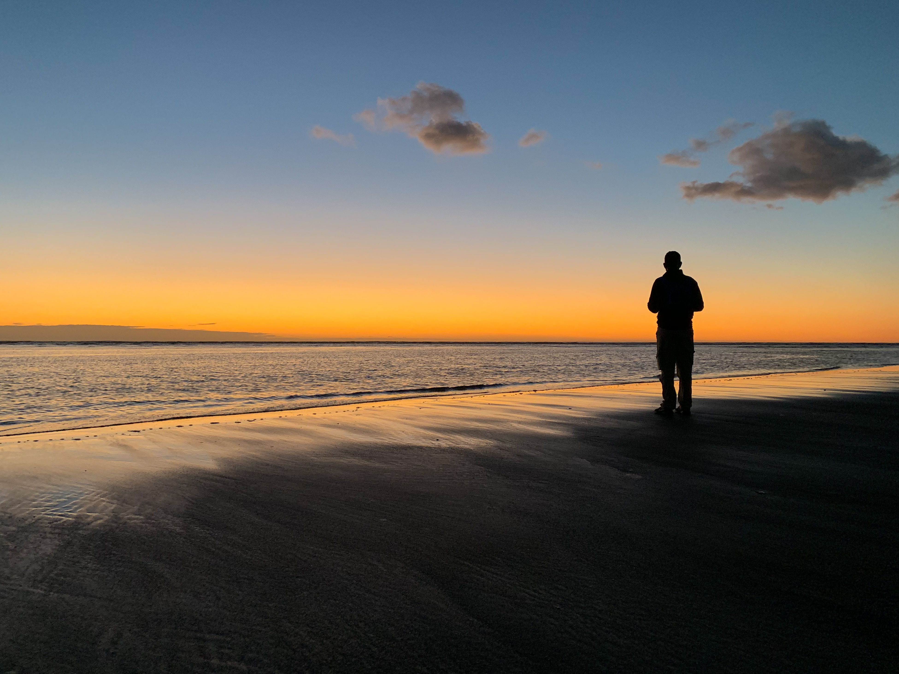

“Oh! Agh!” are the profound words with which I take the first pedals of a thousand mile bicycle tour across New Zealand. Two years ago, Jeb and I completed a trek of comparable length in Scandinavia, my first bike tour. I remember the first few pedal strokes of that trip as a highlight of the adventure: months of planning and the tedious logistics of schlepping a bicycle and two panniers of camping gear from San Francisco to Norway had come to fruition, and finally my world was simple. All I had to do was move my feet in a circle for two weeks. Now, though, I’m rolling out of Auckland International Airport with a rather different feeling. An unlikely mixture of panic and bewildered amusement shoots adrenaline through my veins. It’s midnight, it’s raining, and I have just turned into the oncoming traffic lane. Cars drive on the left here.

Of course, I knew that, on some intellectual level. But as it turns out, learning a fact about traffic patterns six weeks ago does not exactly prepare you to fight your entire life’s experience of driving and riding on the right side of the road. Especially not in the dark. And the rain.

We ride our first three miles (five kilometers, I remind myself) to the motel Jeb booked, and I consider other ways in which I might be underprepared for this trip. I haven’t been on a real bike ride in months. I commute to work by bike in San Francisco most days, but only a few miles. And it’s been cold and wet lately, so I’ve been taking public transit more often.

To my own surprise and deep gratitude, this kind of physical unpreparedness hasn’t been much of a problem in the past. In the months leading up to my Scandinavia tour, I was recovering from an injury and didn’t ride much, but didn’t have a problem adjusting to the daily rigor of touring. Lately though, it has occurred to me that this unearned and undeserved ability will not last forever. Someday, I’ll get on my bicycle after three months of sitting on the couch, with the intention of pedaling 75 miles, only to find that my muscles have finally and permanently transmuted into pizza and left me to suffer the consequences of my sloth. That day could be tomorrow, it occurs to me. Guess we’ll find out soon.

⁂

The first days are hard, and I know they’re probably the easiest we’ll have. I take some solace in the fact that Jeb is struggling too, because he’s probably in better shape than I am. This is a normal adjustment period. Nonetheless, it’s a little unsettling when we decide to cut our first day 20 kilometers short, partly because we’re running out of daylight.

Still, it feels good to be on the bike. It feels good to be on vacation. I vocalize this sentiment several times during our first day.

The morning of day two, the good feelings are temporarily supplanted by a different one: burning pain. Sunburn. Yesterday was overcast, even with misty rain at times, so I completely forgot sunscreen. My arms and legs are bright red. Idiot.

A few hours later, we’re on a short section of gravel cycle path bypassing a busy highway junction. I think about when we took a “gravel” trail in Norway that we learned later was totally impassable by bike. We pushed our bikes for almost the entire day, but I got a few miles of practice over gravel, rocks, and sand, which is considerably trickier on a loaded touring bike than on a mountain bike. My balance and maneuvering got to be pretty good, and it makes shorter, more manageable trails like this a fun diversion from the typical monotony of asphalt.

Thus hubris brings me down. As soon as I think that I’m doing well to be going so fast down this trail, I hit a patch of sand. The bike excuses itself out from under me to the right while I continue, according to the laws of physics, straight ahead and down. Gravel and sand grind into my freshly sunburned forearm, tear through the shoulder of my shirt, and generally leave the right half of my body looking like something out of _The Walking Dead_.

As I dig rocks out of my sunburned arm and Jeb helps wrap it with gauze, I’m so annoyed with myself. “Wow, you’re out of practice,” a friend had said on Instagram that morning in reply to a picture of my sunburn. She’s right. It’s day two, and I’m making stupid mistakes that I’m going to pay for throughout the rest of the trip. I grimly concede that this fall was actually really lucky. For every way it could have gone better, there are ten ways it could have ended my trip. So I try to regard my pain with some gratitude, put those darker hypotheticals out of my head, and pedal on.

⁂

Every day, without fail, someone asks me, “Where’d you start this morning?” and each time I’m caught completely off guard. I feel like one of any dozen amnesic movie characters who awakes in an unfamiliar world and must struggle through the most basic human encounters as he tries to reassemble the pieces of his forgotten life. “Um. I’m not sure. What year is it?” Put on the spot, I have no memory of this morning.  My body is trying desperately to keep my vital organs functioning in spite of the abuse I’m administering it, and there just aren’t enough resources to go around. All non-essential personnel have been escorted from the premises. The short-term memory department is vacant. My insides are squirming as I find myself utterly incapable of answering what was surely not intended to be a trick question.

Even if I could readily recall what my campsite looked like or what I ate for breakfast, I still wouldn’t be able to summon the name of the town. New Zealand’s largest cities have almost caricatural British names: Queenstown, Christchurch, Wellington; but nearly everything else is named in Māori, a language that shares its name with New Zealand’s earliest inhabitants, Polynesian settlers who arrived by canoe in the 13th century. The syllables jumble hopelessly in my linguistically Western-accustomed brain, and I have no idea how to pronounce anything. Was it Tokoroa, or Rotokawa? No wait, Rotorua? Turangi or Tauranga? How exactly does one pronounce Waiouru? Hatepe? Rerewhakaaitu? It turns out that if you can’t convincingly pronounce a place to yourself as you read it on a sign, you’re not going to remember it when someone asks you ten hours later, “Where’d you start this morning?”

“Um. North. 70 miles north. Um. 110 kilometers.” I can’t remember a single detail that would help me identify my extremely recent location on earth, but I can still do fast mental math. My survival mechanisms have weird priorities.

⁂

Taupo feels like a ski resort village grew up and became a town. Granola-chic shops and restaurants line the lakefront, along with a green belt and shared pathway featuring a human-scale, made-for-Instagram block letter sculpture reading “#LOVETAUPO.” It’s a breathtakingly beautiful hub either for the modern outdoor adventurer or for someone who intends to become one through enough shopping of outdoorsy brands. Either way, it feels good to be here, as we’re finally seeing our distance from Auckland grow appreciably on the map. The next day, we tackle the longest and tallest climb of the North Island with less strain than we had expected. The weather has been kind so far. Finally, we’re getting in a groove.

! 
! After a swim at our campsite on the shore of Lake Taupo.

⁂

We awake in Foxton Beach just after the sun, our gear soaked through with dew. Australian magpies haunt the campground with their other-worldly songs. Barring catastrophe, it will be our last day on the North Island. The last few have been strong, and we can taste the sweetness of such a significant checkpoint already.

! 
! Foxton Beach after sunset.

We ride a frigid few kilometers to the local cafe for breakfast. These cafe stops are one of my favorite parts of these trips. I’m well aware of the privileged white tourist stereotype this makes me resemble, but I think it’s defensible here: New Zealand takes breakfast _seriously_. We enter the cafe minutes after it opens, rubbing our hands together for warmth. _Piano Man_ is blaring over the sound system, which feels oddly perfect. In every other way, it’s an archetypal beach cafe for a sleepy beach town, with distressed wood tables and pastel walls. Everything about it is bright and warm and adorable, including the owner. She greets us and brings us each a flat white. Feeling returns to my fingers as I cradle the mug in my hands. I think Jeb is in love.

Breakfast—Eggs Benedict with prosciutto and sautéed spinach—looks like something you might find in a Michelin star restaurant. In the States, a place with this casual of a vibe can be expected to serve bran muffins. Oatmeal at best. Jeb notes his observation about Kiwis’ devotion to breakfast foods to the owner, who tells us her passion for breakfast is so great that when she opened the cafe, she intended to serve it all day. But alas, her husband, the full-time professionally trained chef, refuses to poach an egg after 12:00 PM. As I shovel the deliciously and artfully prepared egg and prosciutto into my mouth, there’s no denying her husband’s culinary prowess. But I can’t help thinking that, given the chance, Jeb would probably poach her an egg at any time of day or night.

! 
! Eggs Benedict in the cafe at Foxton Beach.

⁂

At the beginning of these kinds of trips, I feel a little self-conscious when we intersect too sharply with civilization. We don’t often smell great, we look ridiculous, at any given moment it’s nearly inevitable that _somehow_ I’ve smudged chain grease onto my face, and whenever we enter an establishment, we surreptitiously scan the room for power outlets to charge the small army of dying electronics we’re cradling in our arms. We look like two homeless men in skin-tight clothing. It can be a little uncomfortable.

After about three days, though, something magic happens: all self-consciousness dissipates to make room for some brand of delusional confidence, probably born of the necessity to avoid freaking out about the hundreds of grueling miles that lie ahead. By the time we reach downtown Wellington, where we’ll catch a ferry to the South Island the next morning, this confidence is running high and inhibitions are running low. Which is a good thing, because all the accommodations close to the ferry terminal are, well, not quite _ritzy_, but they’re places with porters and concierges and very modern looking lobbies attached to moodily lit bars. I’ve reserved us a room in one of these hotels, so when we pull up, Jeb stays outside with the bikes and I walk in. A week ago, this would have felt like a nightmare: walking into _here_ looking like _this_. But now, having just completed 430 miles (around 700 kilometers, I remind myself, in case the girl checking us in is impressed and wants to know), clear from one end of the island to the other, I’m strutting into the lobby in my size-too-small bike shorts and fingerless gloves feeling _kind of awesome_ instead of mildly bashful.

No one asks how far we’ve come, but I’m sure they’re impressed anyway.

⁂

Someone once asked me the totally reasonable question of what Jeb and I _do_ while riding, how we pass the long hours in the saddle. Do we ride side by side? Do we talk?

Traffic usually constrains us to riding single-file, which makes conversation difficult. It’s impossible to hear each other when a car is passing (much less a semi full of sheep), so depending on the conditions, it can take a while to get through a single sentence. Most sentences just aren’t worth the hassle.

Jeb likes to watch our progress on the elevation profile to prepare himself mentally for climbs. I listen to podcasts sometimes, with a single AirPod in the ear that faces away from traffic. But the best way to pass the time is to let your mind fall deep into some train of thought you can get totally lost in. These are the times when double-digit miles can disappear without notice. For me, this often takes the form of replaying events from the last few days over and over in my head, trying to uncover thoughts and stories to write about later. Psychologists call this mental repetition _elaborative rehearsal_, and it plays a significant role in forming long-term memories. I like to think that the long, mindless hours help me remember the highlights of these trips forever.

! 
! Mt. Ruapehu and Mt. Ngauruhoe.

Perhaps the most compelling reason to ride single-file, though, is that it’s easier. Drafting off another cyclist, minimizing the force of air resistance on yourself, makes the work significantly easier—up to 50% easier at high speeds or in the face of a strong headwind. Plus, trying to keep my front wheel within inches of Jeb’s rear wheel without causing an accident is a surprisingly effective distraction for passing the time. I used this advantage extensively on the North Island, which Jeb had planned and therefore navigated, riding in front most of the time. But now, on the South Island, it was my turn to ride in front. The increased wind resistance is a rude awakening, and most of the time, Jeb inexplicably rides several meters behind, seemingly throwing away the priceless gift being extended to him by the physics of fluid dynamics. It’s tempting to point out that if he’s going to work that hard, he may as well continue to ride in front so _I_ can draft. But, that’s not how this works. My job now is to navigate to Queenstown, and Jeb can ride wherever he likes. He would even probably switch with me from time to time if I asked, but I want to uphold my end of this tacit agreement with the same grace that he did.

Ugh. Grace and maturity are so hard when you’re tired.

⁂

A few days into the South Island, I’m beginning to worry that the window between hitting my stride and deteriorating into crippling fatigue might be closing rapidly. We’ve been riding for ten days without a day off, and while the South Island offers a reprieve from the heavier traffic of the North Island, it brings bigger climbs, longer stretches without food or water, sand flies, and _bees_. Everyone told us how beautiful the South Island is; nobody told us it’s infested with _bees_. Sometimes it’s impossible to stop and rest without getting swarmed. Jeb and I both have stings, bites, and healing sunburns that make it hard to sleep some nights, compounding the mounting exhaustion the next day.

! 
! Lake Rotoiti at St. Arnaud.

As we leave St. Arnaud and head toward the West Coast, I’m expecting an easy day. Yesterday we spent the whole day climbing from sea level to several thousand feet, and today we’ll do the opposite, reaping the reward of the hard work we put in. Right?

No such luck. The descent is gradual and rolling, and a strong headwind pushes against us the entire day. I have to pedal hard to make forward progress _down_ the hills—I’m convinced that if I coasted, I’d be blown back up in reverse. It feels like a personal affront, like I’ve been robbed of something I earned—no, something I _made_ for myself through a tireless labor of love. The day is, in fact, probably easier than several we’ve put behind us, but the dissonance between expectation and reality is devastating.

We pull into our camping spot at 8:00, our latest arrival yet. It’s dusk, and the air is dark with sand flies that commence biting as soon as we stop moving. Why do I do this?

⁂

I stand in front of my tent, facing south, and switch off my headlamp. Giving my eyes a moment to adjust, I hear the faint rush of the Buller River behind me. The air is cool and damp, and the sand flies have retreated back to wherever bugs go at night. Then, I look up and gaze out into the universe into a direction I’ve never looked before.

The International Space Station floats by, leading my eye east across constellations and galaxies I’ve never seen: the Large Magellanic Cloud, faintly visible. The Southern Cross. Centaurus, Corvus, Crater.

Since I can remember, I’ve felt a child-like wonder at the vastness of the cosmos while staring at the stars in the northern sky. Now, pinpricks of light from countless billions more meet my eyes for the first time, as if to say, _You have no idea what vastness is._

Oh, right. _This_ is why I do this.

⁂

! 
! “Pancake Rocks”

The weather turns wet along the West Coast, alternating between rain and the threat of rain. I’ve planned for us to take our first and only day off at Fox Glacier, which my body desperately needs. Every morning, my legs threaten to go on strike, and a more insidious pain creeps into my lower back after five to ten miles of continuous riding, and becomes unbearable after five more. A ten-minute stretch break seems to fend off the pain for another ten miles or so, but I’m worried that these breaks will have to become longer and more frequent to have the same effect, especially once we head back into the mountains. Jeb and I are fairly well-matched in pace, and stamina, and stubbornness, so the idea of giving up or radically altering our plans has really never come up before, which makes this creeping pain all the more terrifying. I don’t want an injury to force that conversation.

Whenever I find myself in a situation like this, I tend to convince myself that I have no pride to lose over the matter, that I have nothing I need to prove to myself. In 2012, I completed an Appalachian Trail thru-hike, five months walking through woods and over mountains from Georgia to Maine. Only a few hundred people a year successfully complete a thru-hike, and I had no idea if I had what it takes when I started. Ever since, I’ve been able to use that success to reject the idea that I have to overcome every next extreme physical challenge in order to maintain self worth. Sometimes it’s a healthy tool that helps me avoid the risk of injury, and sometimes it’s just a barrier for my ego.

! 
! Fox Glacier peeks out at sunrise.

When we arrive in Fox Glacier, I make the call that we can’t take a day off. Even though I’m terrified that my body might just shut down at the foot of the next hill we encounter, there’s a more dangerous forcing function to consider. We have three days of riding left, the last two containing mountain passes—Haast Pass and Crown Range Pass—and storms are forecast four days from now. If we take a day off, we could very well end up on steep and winding climbs and descents in the rain, with wet roads, low visibility, and heavier traffic as we approach Queenstown. We have to keep moving.

I can’t exactly explain how or why, but during the following day, something shifts in my mind. Even though I’m exhausted, I’m feeling confident, even excited, about the challenging terrain ahead. Realistically, Fox Glacier was my last chance to give up or change course, and it feels good that it was fully _my_ decision to keep going, even to turn up the heat by eliminating our rest day. Two more days sounds doable. I can endure anything for two days.

! 
! The sun comes out on the West Coast before we go back into the mountains.

The last two days and their monstrous ascents are definitely the toughest of the trip, but the closer I come to the finish line, the more unflappably optimistic I become. Haast Pass nearly does Jeb in, so I don enough positivity for both of us. We each do the same physical work day after day, carrying our own bodies, bikes, and gear for 75 miles over thousands of feet of climbing, but we bear the psychological burden in shifts. A few days ago, I might have given up if not for Jeb. At this point, he would still succeed without me, but it feels good to be the one pushing us forward to the end nonetheless.

And so, as Queenstown comes into view and we cross the thousand mile threshold, I realize I was wrong. As soon as I doubted my ability to make it, I _did_ have something to prove to myself: not that I could continue to spin my feet for another 200 miles, but that I could overcome the obstacle of fear and doubt and make those miles a highlight of the trip, that I could be awestruck by the spectacular beauty of the surrounding glacial landscapes instead of being consumed by my own discomfort, and that I could keep our spirits high when Jeb needed encouragement instead of dragging both of us down.

! 
! Jeb photographs Queenstown from Crown Range Pass, the top of our last big climb.

Someday, I _will_ lose the ability to bike a thousand miles in 16 days without training, but I hope I don’t lose the ability to take charge of my own happiness and find the beauty in challenging circumstances. It takes practice. It’s a muscle that has to be trained and exercised sometimes.

Next time, I’ll try to prepare with some _actual_ training too, and get on the bike some before setting out. Probably.

