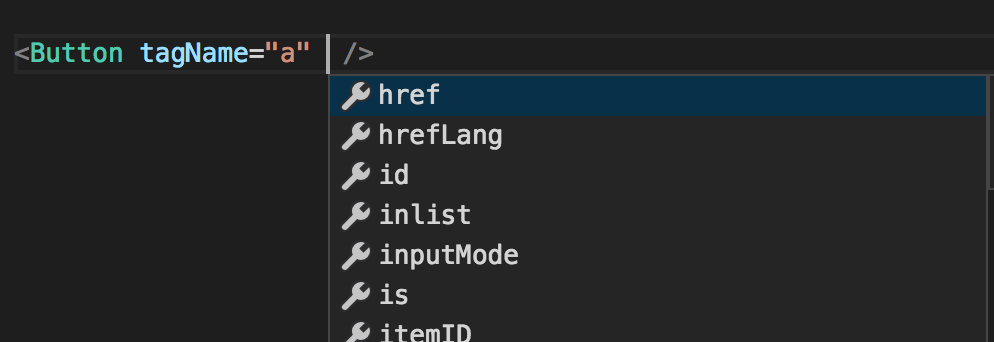

When designing a React component for reusability, you often quickly run into the need to pass different arbitrary DOM attributes to the component’s container in different situations. Let’s say you’re building a `<Button />`. Maybe at first, you just need to allow a custom `className` to be merged in, but eventually you need to support a wide range of attributes and event handlers that aren’t related to the component itself, but rather the context in which it’s used—say, `aria-describedby` when composed with a Tooltip component, or `tabIndex` and `onKeyDown` when contained in a component that manages focus with arrow keys.

It’s impossible for Button to predict and to handle every special context where it might be used, so there’s a reasonable argument for allowing arbitrary extra props to be passed to Button, and letting it pass extra ones it doesn’t understand through. (This consume-what-I-need-and-pass-the-rest-through pattern is quite common and well-understood, but isn’t the focus of this article.)

<!--@
  name: Button1.tsx
-->
```tsx
interface ButtonProps extends React.ButtonHTMLAttributes<HTMLButtonElement> {
  color?: ColorName;
  icon?: IconName;
}

function Button({ color, icon, className, children, ...props }: ButtonProps) {
  return (
    <button
      {...props}
      className={getClassName(color, className)}
    >
      <FlexContainer>
        {icon && <Icon name={icon} />}
        <div>{children}</div>
      </FlexContainer>
    </button>
  );
}
```

Awesome: we can now pass extra props to the underlying `<button>` element, and it’s perfectly type-checked too. Since the props type extends `React.ButtonHTMLAttributes`, we can pass only props that are actually valid to end up on a `<button>`:

<!--@
  name: Button1.tsx
-->
```tsx
<Button onKeyDown={({ currentTarget }) => { /* do something */ }} />
<Button foo="bar" /> // Correctly errors 👍🏽
```

## When passthrough isn’t enough
Half an hour after you send Button v1 to the product engineering team, they come back to you with a question: how do we use Button as a Link? They need it to be able to render as an internal react-router `Link` _or_ as an external link, a plain `HTMLAnchorElement`.

If we weren’t concerned about type safety, we could write this pretty easily:

<!--@
  name: Button2.jsx
-->
```tsx
function Button({ color, icon, className, children, tagName: TagName, ...props }) {
  return (
    <TagName
      {...props}
      className={getClassName(color, className)}
    >
      <FlexContainer>
        {icon && <Icon name={icon} />}
        <div>{children}</div>
      </FlexContainer>
    </TagName>
  );
}

Button.defaultProps = { tagName: 'button' };
```

This makes it trivial for a consumer to use whatever tag or component they like as the container:

<!--@
  name: Button2.jsx
-->
```tsx
<Button tagName="a" href="https://github.com">GitHub</Button>
<Button tagName={Link} to="/about">About</Button>
```

But, how do we type this correctly? Button’s props can no longer unconditionally extend `React.ButtonHTMLAttributes`, because the extra props might not be passed to a button.

_Fair warning: I’m going to go down a serious rabbit hole to explain several reasons why this doesn’t work well. If you’d rather just take my word for it, feel free to [skip ahead](#an-alternative-approach) ._

Let’s start with a slightly simpler case where we only need to allow `tagName` to be `'a'` or `'button'`. (I’ll also remove props and elements that aren’t relevant to the point for brevity.) This would be a reasonable attempt:

<!--@
  name: Button3.tsx
-->
```tsx
interface ButtonProps {
  tagName: 'a' | 'button';
}

function Button<P extends ButtonProps>({ tagName: TagName, ...props }: P & JSX.IntrinsicElements[P['tagName']]) {
  return (
    <TagName {...props} />
  );
}

<Button tagName="a" href="/" />
```

The two immediate observations that arise are

1. It doesn’t compile—it tells us, in so many words, that the type of `props.ref` is not correct for the type of `TagName`.
2. Despite that, it _does_ kind of produce the results we want when `tagName` is inferred as a string literal type. We even get completions from `AnchorHTMLAttributes`:



However, a little more experimentation reveals that we’ve also effectively disabled excess property checking:

<!--@
  name: Button3.tsx
-->
```tsx
<button href="/" /> // correct error 👍
<Button tagName="button" href="/" /> // no error 👎
```

Every prop you put on Button will be inferred as a property of the type parameter `P`, which in turn becomes part of the props that are allowed. In other words, the set of allowed props always includes all the props you pass. The moment you add a prop, it becomes part of the very definition of what Button’s props should be. (In fact, you can witness this by hovering `Button` in the example above.) This is decidedly the opposite of how you intend to define React components.

### What’s the problem with `ref`?
If you’re not yet convinced to abandon this approach, or if you’re just curious why the above doesn’t compile cleanly, let’s go deeper down the rabbit hole. And before you implement a clever workaround with `Omit<typeof props, 'ref'>`, spoiler alert: `ref` isn’t the only problem; it’s just the _first_ problem, and the compiler didn’t keep doing work to find all the rest of the problems. The rest of the problems are _every event handler prop_. You can discover this, if you want, by going into the React typings and commenting out [the `ref` property](https://github.com/DefinitelyTyped/DefinitelyTyped/blob/86303f134e12cf701a3f3f5e24867c3559351ea2/types/react/index.d.ts#L97). The compiler error will remain, substituting `onCopy` where it previously said `ref`.

So what do `ref` and `onCopy` have in common? They both have the general form `(param: T) => void` where `T` mentions the instance type of the DOM element rendered: `HTMLButtonElement` for buttons and `HTMLAnchorElement` for anchors, for example. With `--strictFunctionTypes` enabled, function signatures are _contravariant_ in the parameter position, which has this property of transforming unions to intersections (and vice versa) that is easier to show than to say:

<!--@
  name: contravariance.ts
-->
```ts
// Super simplified props definitions
type ButtonProps = { type?: string, ref: (instance: HTMLButtonElement) => void };
type AnchorProps = { href?: string, ref: (instance: HTMLAnchorElement) => void };

// Imagine JSX tags are just function calls
declare function a(props: AnchorProps): any;
declare function button(props: AnchorProps): any;

// You’ve got some props that might be either one
declare const props: ButtonProps | AnchorProps;

// And a TagName that might be either one
declare const TagName: typeof a | typeof button;

// You can see that props.ref wants HTMLButtonElement & HTMLAnchorElement
props.ref(document.createElement('button'))

// Which is why it won’t work as the props of TagName
TagName(props);

// In fact, it won’t work as the props of `a` or `button` either.
// This actually feels like less of a surprise, and should make
// the error on `TagName(props)` less surprising.
a(props);
button(props);
```

Since `keyof IntrinsicElements` is a union, `Props` is a union, and thus `Props['ref']` is a union of two signatures. So far, one union type has distributed into additional unions. But when calling `props.ref`, the logic inverts: rather than requiring the union of the parameter types, `HTMLAnchorElement | HTMLButtonElement`, it requires the _intersection_: `HTMLAnchorElement & HTMLButtonElement`—a theoretically possible type, but not one that will occur in the wild of the DOM. And we know intuitively that if we have a React element that’s either an anchor or a button, the value passed to `ref` will be either be an `HTMLAnchorElement` or an `HTMLButtonElement`, so the function we provide for `ref` must accept an `HTMLAnchorElement | HTMLButtonElement`. Ergo, back to our original component, we can see that `JSX.IntrinsicElements[P['tagName']]` legitimately allows unsafe types for callbacks when `P['tagName']` is a union, and that’s what the compiler is complaining about. The manifest example of an unsafe operation that could occur by ignoring this type error:

<!--@
  name: Button3.tsx
-->
```tsx
<Button
  tagName={'button' as 'a' | 'button'}
  ref={(x: HTMLAnchorElement) => x.href.toLowerCase()}
/>
```

This type checks because `HTMLAnchorElement` is assignable from `HTMLAnchorElement & HTMLButtonElement`, when the thing we _should_ have been checking is whether `HTMLAnchorElement` is assignable from `HTMLAnchorElement | HTMLButtonElement`. This will error at runtime since buttons don’t have an `href` property.

### Variance shmariance, I’m gonna make it work
Ok, fine. Let’s say you work out a way to transform callback prop signatures to the proper variance, and you’re ready to replace `tagName: 'a' | 'button'` with `tagName: keyof JSX.IntrinsicElements`.

<!--@
  name: Button4.tsx
-->
```tsx
interface ButtonProps {
  tagName: keyof JSX.IntrinsicElements;
}

function Button<P extends ButtonProps>({ tagName: TagName, ...props }: P & JSX.IntrinsicElements[P['tagName']]) {
  return (
    // @ts-ignore YOLO
    <TagName {...props} />
  );
}

Button.defaultProps = { tagName: 'button' };

<Button tagName="a" href="/" />
``` 

…and, congratulations, you’ve crashed TypeScript 3.4! The union distributes over the intersection with `P`, adding `defaultProps` results in instantiations of multiple levels of nested distributive conditional types, and you’ve just invented a button that cannot be reasoned about within Node’s default heap size. And we never even got around to supporting `<Button tagName={Link} />`!

TypeScript 3.5 _does_ handle it without crashing by deferring a lot of the work that was happening to simplify conditional types, but do you _really_ want to write components that are just waiting for the right moment to explode?

## An alternative approach
As we go back to the drawing board, let’s refresh on what we’re actually trying to accomplish. Our Button component should:

* be able to accept arbitrary props like `onKeyDown` and `aria-describedby`
* be able to render as a `button`, an `a` with an `href` prop, or a `Link` with a `to` prop
* ensure that the root element has all the props it requires, and none that it doesn’t support
* not crash TypeScript or bring your favorite code editor to a screeching halt

It turns out that we can accomplish all of these with a render prop. I propose naming it `renderContainer` and giving it a sensible default:

<!--@
  name: GoodButton.tsx
-->
```tsx
interface ButtonInjectedProps {
  className: string;
  children: JSX.Element;
}

interface ButtonProps {
  color?: ColorName;
  icon?: IconName;
  className?: string;
  renderContainer: (props: ButtonInjectedProps) => JSX.Element;
  children?: React.ReactChildren;
}

function Button({ color, icon, children, className, renderContainer }: ButtonProps) {
  return renderContainer({
    className: getClassName(color, className),
    children: (
      <FlexContainer>
        {icon && <Icon name={icon} />}
        <div>{children}</div>
      </FlexContainer>
    ),
  });
}

const defaultProps: Pick<ButtonProps, 'renderContainer'> = {
  renderContainer: props => <button {...props} />
};
Button.defaultProps = defaultProps;
```

Let’s try it out:

<!--@
  name: GoodButton.tsx
-->
```tsx
// Easy defaults
<Button />

// Renders a Link, enforces `to` prop set
<Button
  renderContainer={props => <Link {...props} to="/" />}
/>

// Renders an anchor, accepts `href` prop
<Button
  renderContainer={props => <a {...props} href="/" />}
/>

// Renders a button with `aria-describedby`
<Button
  renderContainer={props =>
    <button {...props} aria-describedby="tooltip-1" />}
/>
```

We completely defused the type bomb by getting rid of the 172-constituent union `keyof JSX.IntrinsicElements` while simultaneously allowing even more flexibility, _and_ we get perfect type safety. Mission accomplished. 🎉 

## The overwritten prop caveat
There’s a small cost to an API design like this, which is that it’s fairly easy to make a mistake like this:

<!--@
  name: GoodButton.tsx
-->
```tsx
<Button
  color={ColorName.Blue}
  renderContainer={props =>
    <button {...props} className="my-custom-button" />}
/>
```

Oops. `{...props}` already included a  `className`, which was needed to make the Button look nice and be blue, and here we’ve completely overwritten that class with `my-custom-button`.

On one hand, this provides the ultimate degree of customizability—the consumer has total control over what does and doesn’t go onto the container, allowing for fine-grained customizations that weren’t possible before. But on the other hand, you probably wanted to merge those classes 99% of the time, and it might not be obvious to the people using this component why it appears visually broken in this case.

Depending on the complexity of the component, who your consumers are, and how solid your documentation is, this may or may not be a serious problem. When I started using patterns like this in my own work, I wrote a [small utility](https://github.com/andrewbranch/merge-props) to help with the ergonomics of merging injected and additional props:

<!--@
  name: GoodButton.tsx
-->
```tsx
<Button
  color={ColorName.Blue}
  renderContainer={props =>
    <button {...mergeProps(props, {
      className: 'my-custom-button',
      onKeyDown: () => console.log('keydown'),
    })} />}
/>
```

This ensures the class names are merged correctly, and if `ButtonInjectedProps` ever expands its definition to inject its own `onKeyDown`, both the injected one and the console-logging one provided here will be run.
