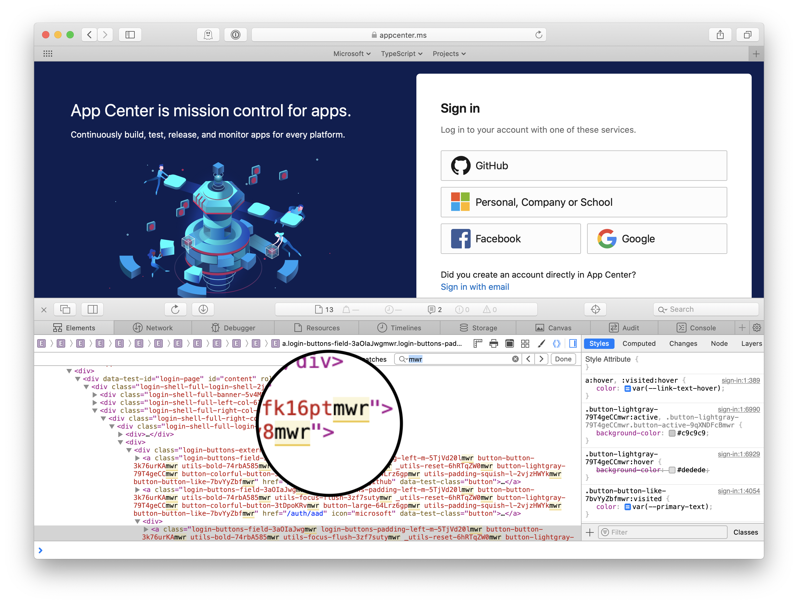
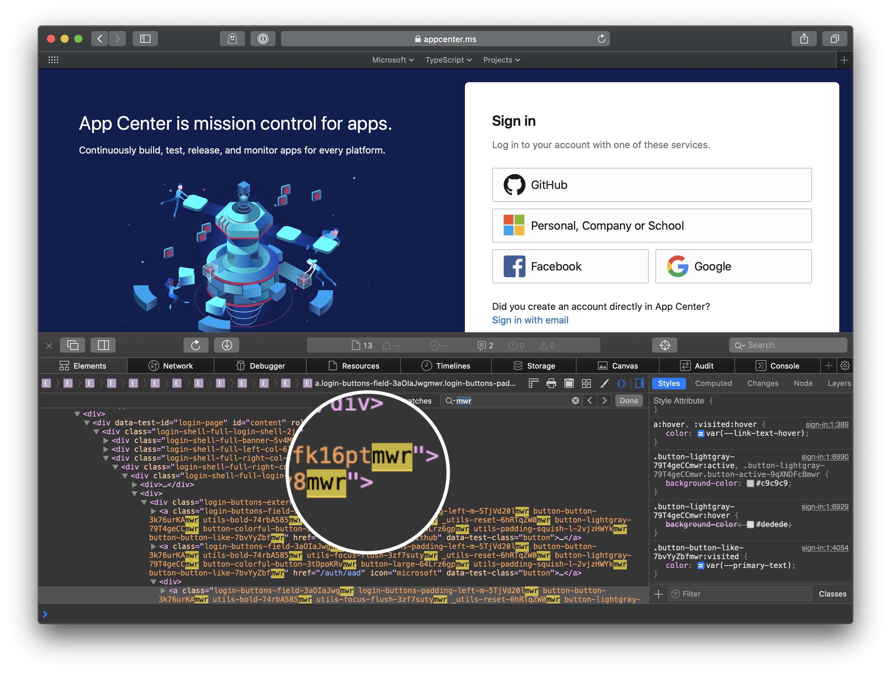

<small-caps>In early 2016</small-caps>, I was working as a web developer on the marketing team at Xamarin. We had just built the event site for the third Xamarin Evolve, the company’s developer conference, to be held in Orlando in the spring. The event afforded an opportunity to our designers to push the Xamarin brand and palette into more adventurous territory, so the site materialized at a larger-than-life scale, with massive all-caps headings, hundreds of pixels between sections, and neon SVG animations, all set atop a vertical gradient background rotating through every color of a Florida sunset.

My teammates and I also used it as an opportunity to try out some newer tech than what we had inherited in the monolithic .NET company site. React, Webpack, and CSS modules were becoming dominant forces in the frontend web world, and we were excited to bring a modern toolset into into our daily work. The result was infrastructural overkill, but it was also rapid iteration and developer happiness.

In April, less than a month before the conference, we received two independent bug reports that the registration button—the single most important link on the site—was *missing* on mobile Safari. When we couldn’t reproduce the bug on our own devices or on any iOS simulator device, it was difficult to determine next steps—it’s tough to fix a bug you can’t observe. Eventually, after broadcasting a plea across the company Slack, we found a coworker whose iPhone exhibited the bug, and my teammate, [Clay](https://www.smockle.com), determined that the content blocker [Purify](https://www.purify-app.com) was hiding the button.

But… why? The content blocker wasn’t using any suspicious custom configuration; it was just supposed to block ads. What was unique about the registration button, when other buttons on the site were displaying correctly? Plugging the phone into a Mac and inspecting the button with Safari’s developer tools eliminated the guesswork. Purify was injecting a large number of CSS rules into the page, including this one:

```css
[class$=Ad] {
  display: none;
}
```

That attribute selector syntax means *hide everything with a class name ending in “Ad.”* [^1]

And sure enough, that applied to our button. We didn’t author a class ending in “Ad”; rather, we were having Webpack append a base64 content hash to the end of each selector to guarantee uniqueness across CSS files and prevent naming collisions, as is the common practice with CSS modules:

```
localIdentName=[name]__[local]___[hash:base64:5]
```

This meant that for a class name `register-button` in a file `styles.css`, the emitted class name would be something like `styles__register-button__fQ2Ad`, where the five-character suffix is a hash of the file content and the original class name—effectively a random set of letters and numbers. And it just happened that after an innocuous update of other CSS in that file, the hash for the single most important element on the page changed to end in `Ad`.[^2]

A wacky solution to a wacky problem—if you don’t want a random string to end in `Ad`, make sure it ends in something else:


Clay appended the letter `c` to every generated class name. Problem solved.

Interacting with buggy websites is a near daily occurrence, and as a software engineer who, I like to think, generally did a good job with the material I created when I worked in web, I instinctively feel incredulous when I encounter glaring errors on high-traffic production sites. *This login form had one job. Who did something dumb?* When I think about our vanishing button, I’m inclined to look more generously at mistakes that appear to reflect incompetency. The simplicity of the bugs we observe often belies the complexity of the systems that created them.

⁂

A year later, I was writing the Webpack configuration for [App Center](https://appcenter.ms) with the same teammates who worked with me on the Evolve site, and recalling the Purify incident, I preemptively guarded our loader configuration against it. In the period after Xamarin was acquired by Microsoft, we were still officially on the Xamarin marketing team, but as Xamarin work was winding down, we were starting to spending much of our time helping App Center get off the ground. We had a sense of pride, I think, that we were working on rather fundamental pieces of infrastructure as a rag-tag band of outsiders from a *marketing* team. And so, with the atmosphere of team spirit and all the creative maturity of a nine-year-old, I chose to suffix the content hash with the letters `mwr`, a secret acronym for “Marketing Web rules.” It had a practical justification as well, I told myself, since choosing *multiple* letters that are phonetically incongruous and never appear at the end of any word, I supposed, would have even lower chances of triggering overzealous ad-blocking rules. I committed the configuration, and then completely forgot about it for the next three years, until starting to write this post.

In those intervening years, App Center has moved repositories twice, gone through at least two major version upgrades of Webpack, formed an official core frontend team, and turned over the majority of that original team, myself included. So there was no way our little easter egg survived all that churn, I thought. It must have been lost, or someone must have removed it after noticing it in the source, in the browser developer tools, or in all the times it’s come up in Slack when someone pastes a Webpack error message originating from css-loader.

<!--@@
  wrapperClassName: light-only
-->


<!--@@
  wrapperClassName: dark-only
-->


Nope. To this day[^3], the string `mwr` appears 167 times in the DOM on the login page alone. Woops. I’m grateful for gzip.

[^1]: It appears that Purify has since removed wildcard attribute selectors like this one.
[^2]: A little back-of-the-napkin math: assuming a hash algorithm with a perfectly uniform distribution, the odds of a base64 string having a particular _N_-character suffix is $1 / 64^N$. So, the chances of any one of our hashes ending in “Ad” was 1 in 4096. I had always assumed this event was a statistical anomaly, but given the number of CSS classes we generated (not just per-build, but over the course of dozens of updates where hashes were regenerated), it starts to look less surprising.
[^3]: Before publishing this piece, I gave the App Center team a heads up, and they promptly shortened class names in production down to just an 8-character hash (plus the letter `x`, for good measure), citing a 1.4% reduction in post-compression asset weight on the login page. In non-production environments? Still `mwr`. 😄